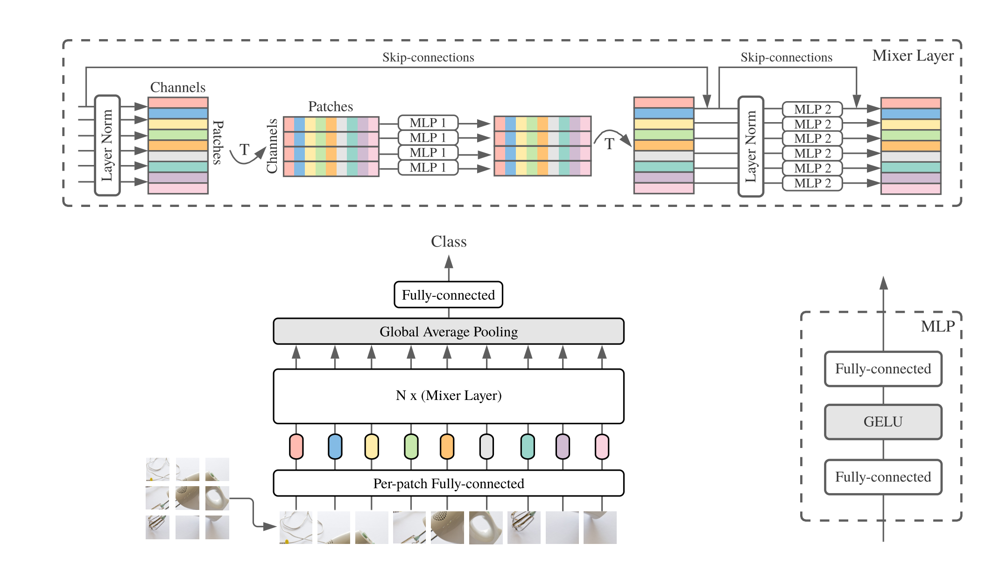

# MLP Mixer: An all-MLP Architecture for Vision

(In Progress) PyTorch implementation of MLP Mixer [[Paper](https://arxiv.org/pdf/2105.01601.pdf)] [[Official Code](https://github.com/google-research/vision_transformer)] [[Other PyTorch Code](https://github.com/lucidrains/mlp-mixer-pytorch)]




## Todo

- [   ]  Dataloader
- [   ]  Channel Mixer
- [   ]  Token Mixer
- [   ]  Train / Test


## Usage

```python
TBD
```


## Reference

[1] Ilya Tolstikhin, Neil Houlsby, Alexander Kolesnikov, Lucas Beyer, et al., MLP-Mixer: An all-MLP Architecture for Vision, Google Research, Brain Team, May 2021

[2] https://github.com/lucidrains/mlp-mixer-pytorch


